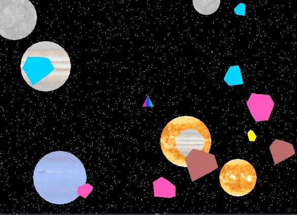
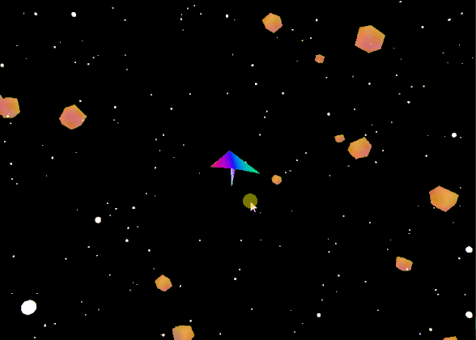
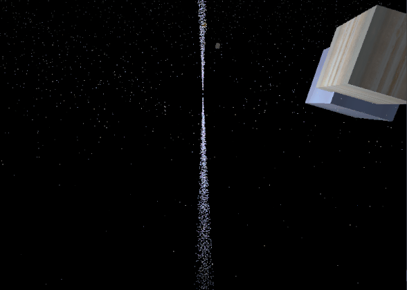

# Graphics For Gaming
Newcastle University CSC3223

## Simple Graphics Scene
- 2D scene (1990s Atari Space Games Look-Like) : type2 
- 3D scene (3D scene in outer space) : type3 
- Rasterisation : type F9

## Shaders
- 3D boxes with different effects (some of them don't work depending on GPU due to GL shader language's dependency)
  - bubble box: type p to pause first and then type 0
  - volcano box: type p to pause first and then type 1
  - checker box: type p to pause first and then type 2
  - outer-space boxes: type p to pause first and then type 3 
